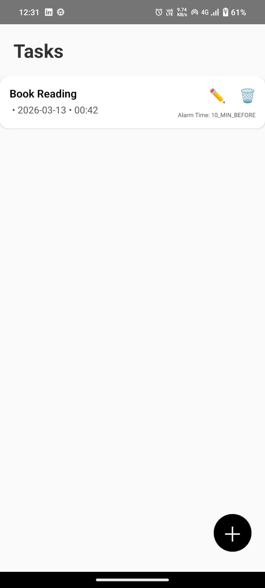
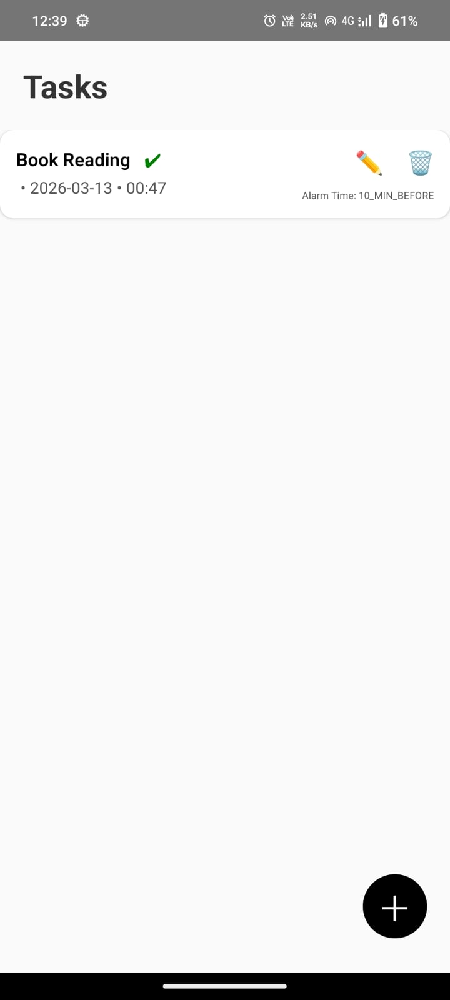

## 1️⃣ Project overview

AlarmTodoApp is a **React Native task & reminder app**
It lets you create tasks with a due date and time, configure when you want to be reminded (alarm offset), and mark them as completed once done.

Each task/reminder currently supports:
- **Title** (required)
- **Description / note** (optional)
- **Due date**
- **Task time**
- **Alarm time offset** (e.g. 10 minutes before)
- **Completion status** with a visual tick in the list

The app uses **local storage** and **local notifications**, so everything runs entirely on-device.

---

## 2️⃣ Screenshots / demo

> Replace these placeholders with real screenshots from your device / emulator.

- **Home screen (Tasks list)** – shows upcoming tasks with date, time, alarm info, and completion tick.
- **Add Task / Reminder modal** – modal form for creating a task with date, time, alarm offset and note.
- **Edit Task modal** – update task fields and mark as completed.

You can capture screenshots from your device/emulator and drop them into a `screenshots/` folder, then link them here:

```md




```

---

## 3️⃣ Features

- **Task / reminder management**
  - Add tasks with title, description, date and time.
  - Edit existing tasks in a dedicated modal.
  - Delete tasks with a confirmation flow.

- **Completion tracking**
  - Mark tasks as **completed** from the edit modal.
  - Completed tasks show a **green tick** next to the title in the list.

- **Alarm & notifications**
  - Configurable **alarm time offsets** when creating or editing:
    - At time of task
    - 10 minutes before
    - 20 minutes before
    - 1 day before
  - Uses `@notifee/react-native` to schedule local notifications on Android.
  - Notification channel is configured with **sound, vibration and screen wake**.

- **UI / UX**
  - Floating **Add Task** button.
  - Reusable modals for add/edit.
  - Uses **Material Icons** (via `react-native-vector-icons`) for edit and delete actions in the task card.

---

## 4️⃣ Tech stack

- **Core**
  - `react` `19.2.0`
  - `react-native` `0.83.1`

- **Navigation**
  - `@react-navigation/native`
  - `@react-navigation/native-stack`
  - `@react-navigation/bottom-tabs`

- **Storage & utilities**
  - `@react-native-async-storage/async-storage` – persistent local storage for tasks/reminders.

- **Notifications / alarm**
  - `@notifee/react-native` – local notifications with channels, sound, vibration.

- **UI helpers**
  - `@react-native-community/datetimepicker` – date & time pickers.
  - `react-native-vector-icons` – edit/delete icons in the task card.  
    (Make sure this dependency is installed in your local environment.)

---

## 5️⃣ Project structure

High‑level `src/` layout (only key files shown):

```text
src/
  components/
    AddReminderButton.js      // Floating button to open Add modal
    AddReminderModal.js       // Modal to create a new task/reminder
    EditReminderModal.js      // Modal to edit an existing reminder
    AddTaskButton.js          // Floating button variant for tasks
    AddTaskModal.js           // Modal to create a new task (TaskStorage-based)
    EditTaskModal.js          // Modal to edit an existing task
    ReminderCard.js           // Card displaying task info + actions
    ConfirmDeleteModal.js     // "Are you sure?" delete confirmation
    LatestReminderModal.js    // Shows latest reminder details
  

  screens/
    HomeScreen.js             // Main list of tasks/reminders

  storage/
    reminderStorage.js        // AsyncStorage helpers for reminders
    TaskStorage.js            // AsyncStorage helpers for tasks

  utils/
    notificationService.js    // Notifee-based scheduling for alarms
    notifications.js          // Legacy push notification utilities
    dateUtils.js              // Small date helpers

  navigation/
    AppNavigator.js           // Navigation container & stacks
```

> Note: Some parts still use "Reminder" naming for backward compatibility while newer parts use "Task" – both share the same basic shape (title, note, date, time, completed, alarmTime).

---

## 6️⃣ Setup instructions

### Prerequisites

- Node.js **>= 20** (as defined in `package.json`).
- React Native development environment set up for Android (and optionally iOS):  
  see the official guide: [`Set Up Your Environment`](https://reactnative.dev/docs/set-up-your-environment).

### Install dependencies

From the project root:

```sh
# Using npm
npm install

# If you want vector icons (recommended)
npm install react-native-vector-icons
```

On iOS (if you add an iOS target later), you will also need to install CocoaPods in the `ios/` folder:

```sh
cd ios
bundle install
bundle exec pod install
cd ..
```

### Run Metro

```sh
npm start
```

### Run on Android

With Metro running in another terminal:

```sh
npm run android
```

The app should start on your connected device or emulator.

### Notifications / alarm notes

- On **Android 13+**, make sure to **grant notification permissions** when prompted, or manually from system settings.
- If you change notification-related code (like channels), uninstall and reinstall the app to ensure channels are recreated.

---

## 7️⃣ Author information

- **Author**: _Tejas SHivaji Ranbawale_
- **Role**: _React Native developer_  
- **Contact**: _7875325924_
- **Email**: _tejasranbawale@gmail.com_
- **GitHub**: _https://github.com/tejasranbawale_  

